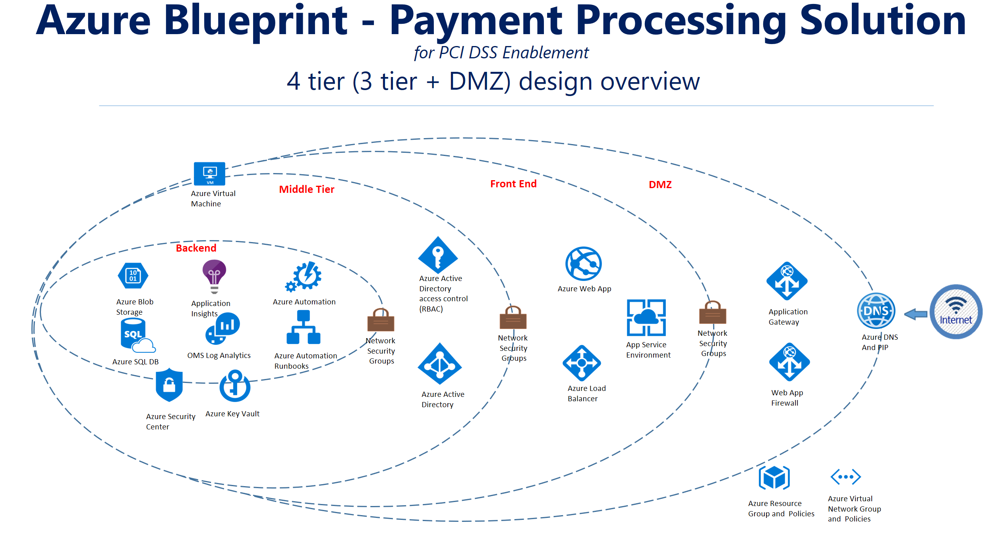
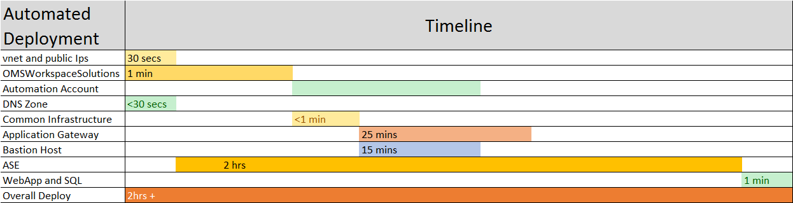
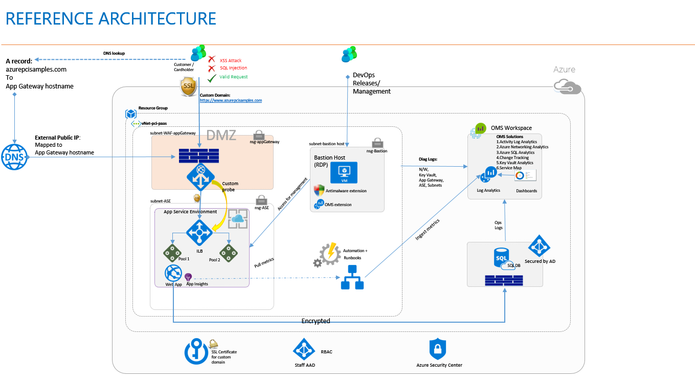
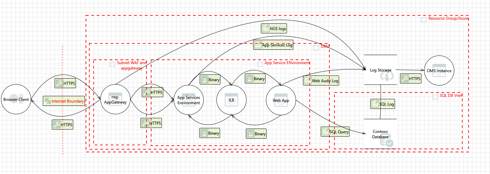

# Azure Blueprint - Payment processing solution  

>  for PCI DSS enablement 

### PUBLIC PREVIEW BETA 1


*Published May 2017*

*This document is for informational purposes only. MICROSOFT AND AVYAN MAKE NO WARRANTIES, EXPRESS, IMPLIED, OR STATUTORY, AS TO THE INFORMATION IN THIS DOCUMENT. This document is provided “as-is.” Information and views expressed in this document, including URL and other Internet website references, may change without notice. Customers reading this document bear the risk of using it.*
*This document does not provide customers with any legal rights to any intellectual property in any Microsoft or Avyan product or solutions.* 
*Customers may copy and use this document for their internal, reference purposes.*
*NOTE: Certain recommendations in this paper may result in increased data, network, or compute resource usage in Azure, and may increase a customer’s Azure license or subscription costs.*
*The solution in this document is intended as a reference architecture pilot and should not be used as-is for production purposes.  Achieving PCI compliance requires that customers consult with their Qualified Security Assessor.*

*This solution was developed cooperativly by Microsoft and Avyan consulting.*

# ACKNOWLEDGEMENTS

### Authors of the document 

* *Frank Simorjay (Microsoft)*  
* *Gururaj Pandurangi (Avyan Consulting)*

### Disclaimer 
This solution is intended as a reference architecture pilot and should not be used as-is for production purposes.
- Achieving PCI Compliance requires Customers to consult with their QSA.
- This reference architecture provides a template to help customers use Microsoft Azure in a PCI DSS-compliant manner. 
- Customer is responsible for conducting appropriate security and compliance reviews of any solution built with this reference architecture, as requirements may vary based on the specifics of customer’s implementation and geography. 
- PCI DSS requires that an accredited Qualified Security Assessor certify Customer’s solution.
- All customer names, transactions records and any related data on this page are created for the purpose of the POC and are provided for illustration only and are fictitious.  No real association or connection is intended or should be inferred.


* Microsoft would like to thank <a href="mailto:azurecompliance@avyanconsulting.com" target="_blank"> azurecompliance@avyanconsulting.com </a> for developing this solution.
License <a href="https://opensource.org/licenses/MIT" target="_blank"> MIT </a>  


# TABLE OF CONTENTS 
<!-- TOC -->
- [ACKNOWLEDGEMENTS](#acknowledgements)
- [TABLE OF CONTENTS](#table-of-contents)
- [SOLUTION DESCRIPTION OBJECTIVE AND SCENARIO](#solution-description-objective-and-scenario)
- [USER SCENARIO](#user-scenario)
- [PRE DEPLOYMENT REQUIREMENTS](#pre-deployment-requirements)
- [SOLUTION DEPLOYMENT](#solution-deployment)
- [POST DEPLOYMENT USER EXPERIENCE SETUP](#post-deployment-user-experience-setup)
- [LOGGING AND MONITORING](#logging-and-monitoring)
- [DEPLOYMENT ARCHITECTURE](#deployment-architecture)
- [FAQ AND FIXES](#faq-and-fixes)
- [THREAT MODEL](#threat-model)
- [SUPPORT PROCESS](#support-process)
<!-- /TOC -->


# SOLUTION DESCRIPTION OBJECTIVE AND SCENARIO
  


  


The Azure blueprint solution is intended to simplify azure adoption, showcase commonly used reference architecture, and teach how to deploy a secure and compliant PaaS solution for customer considering the complexities of storing sensitive payment card related data. 
The solution joint developed with Avyan consulting (Microsoft MVP partner) was designed to illustrate an end to end solution that can satisfy the needs in organizations that maybe looking for a cloud solution to reduce the burden, or cost of deployment.
This solution enables the ability to:

-	Collect, store, and retrieve payment card data while complying with stringent Payment Card Industry, Data Security Standards (PCI DSS) requirements.

This solution illustrates the management of credit card data including card number, expiration, CVC (Card Verification Check) numbers securely in a four-tier secure and compliant solution could be deployed as an end-to-end Azure solution.





### Components of the Blue print

-   **Solution blueprint**. The blueprint provides an understanding of how Contoso webstore (a fictitious organization) achieved its compliant state. Included in the solution package is a completed PCI – DSS responsibility matrix for Contoso webstore.
-   **Reference architecture**. The reference architecture provides the design that was used for the Contoso webstore solution.
-   **Azure Resource Manager (ARM) templates**. In this deployment, JavaScript Object Notation (.JSON) files provide Microsoft Azure the ability to automatically deploy the components of the reference architecture after the configuration parameters are provided during setup.
-   **PowerShell scripts**. The scripts created by [Avyan Consulting Corp](www.avyanconsulting.com/azureservices) solution help set up the end-to-end solution. The scripts consist of:
    -   Module installation script that will install required PowerShell modules for
    the installation. This script will require local administrator rights.
    -   Global administrator setup script establishes the needed admin user to
    deploy the solution
    -   A pre-installation process that establishes user roles and establishes
    required parameters in Microsoft Active Directory to ensure the correct
    role-based access control mechanisms are deployed. This process includes
    configuring separation of duties for core administrators and users.
    -   A post-installation process that deploys an [ARM template, web front-end
    runtime, and SQL backpack](https://github.com/Microsoft/azure-sql-security-sample) built by the Microsoft SQL team, and revised for this scenario by Avyan Consulting Corp. The Contoso webstore Demo Application provides the framework for the solution user scenario. The templates and scripts build out a web application and SQL database that use the App Service Environment to provide service isolation     from the front end to the back end. The script also establishes a means to manage changes in the environment by creating a dev/test environment. For additional details about the reference architecture, data flow, and configuration, see Section 6 of this document.

### Visualize Azure Resources before you deploy 

For deployment details refer to section DEPLOYMENT GUIDE below

<a href="http://armviz.io/#/?load=https%3A%2F%2Fraw.githubusercontent.com%2FAvyanConsultingCorp%2Fpci-paas-webapp-ase-sqldb-appgateway-keyvault-oms%2Fmaster%2Fazuredeploy.json" target="_blank">

</a>


# USER SCENARIO


> This scenario illustrates how a fictitious webstore clinic migrated their patient intake, and payment card processing to Azure. 


A small webstore called, Contoso webstore is ready to move their payment system to the cloud. They have selected Microsoft Azure to host the
 process for purchasing and to allow a  clerk to collect credit card payments from their customer.

The administrator is looking for a solution can be quickly deployable to achieve his goals. He will use this proof-of-concept (POC) to understand how Azure can be used to accomplish the following:

-   Collect, store, and retrieve payment card data while complying with
    stringent Payment Card Industry, Data Security Standards (PCI DSS)
    requirements

Because this is a POC that installs the required elements to operate a service,
it is not a customer ready-to-go solution. It requires careful understanding of
all the regulations and laws that your organization must abide by.

*You will be responsible for conducting appropriate security and compliance reviews of any
solution built with the architecture used by this POC, as requirements may vary
based on the specifics of your implementation and geography. PCI DSS requires
that you work directly with an accredited Qualified Security Assessor to certify
your production ready solution.*

### The contosowebstore POC

The POC solution is designed with the following fictitious employees of `contosowebstore.com`:

Two user roles are used only to illustrate use case, and provide insight into the user interface, and two service backend users are created durring the installation of this solution.  

The following two service users are created to manage and administer the solution.


#### Role: Site and Subscription Admin

|Item      |Example|
|----------|------|
|Username: |`admin`|
| First name: |`Admin`|
|Last name: |`Admin`|
|User type:| `Subscription Administrator`|


* admin cannot read SSN or credit card information unmasked. In addition, all actions are logged.
* admin cannot manage or log into SQL database.
* admin can manage active directory, and subscription

#### Role: Sql Administrator

|Item      |Example|
|----------|------|
|Username: |`sqladmin`|
| First name: |`SQL`|
|Last name: |`Admin`|
|User type:| `Administrator`|


* sqladmin cannot credit card information. sqladmin can read SSN information. In addition, all actions are logged.
* sqladmin can manage SQL database.


#### Role: Clerk

|Item      |Example|
|----------|------|
|Username:| `EdnaB`|
| First name:| `Edna`|
|Last name:| `Benson`|
| User type: |`Member`|

Edna Benson is the Clerk, and business manager. She is responsible to ensure that patient customer information is accurate, and billing is completed. Edna will use the **patient** data in the following manner:


* Edna can Create, read patient information, read date of birth (DOB)*
* Edna will be able to modify patient information.
* Edna can overwrite (or replace) credit card number, expiration, and CVC verification information.
* Edna can replace stored Social Security number (SSN)
* Edna cannot read stored SSN or credit card information unmasked. In addition, all her actions are logged.


In the `Contoso webstore` Demo User Application, you will be logged in to is configured to use **Edna** and able to test the capabilities of the deployed environment.


### contosowebstore Azure pricing sample calculation

The solution cost sample has a monthly fee structure and a use per hr. to
consider when sizing the solution. This example deployment **estimate** cost using the [Azure costing calculator](https://azure.microsoft.com/en-us/pricing/calculator/). The solution 
consist of the following items:

| **Service type** | **Custom name** | **Region** | **Description** | **Estimated Cost** | 
| ----------------- | --------------- | ----------- | -------------- | ----------------- | 
| Virtual Machines | Virtual Machines | South Central US | 1 Standard virtual machine(s), D1 (1 cores, 3.5 GB RAM, 50 GB disk) size: 1 months | $96.72 | 
| App Service | App Service | South Central US | 1 instance(s), 744 hours, size: s1, standard tier, 0 SNI connection(s), 0 IP connection(s) | $74.40 | 
| IP Addresses | IP Addresses | East US | arm type, 1 public IP Address(es) x 1 months | $2.98 | 
| SQL Database | SQL Database | East US | 1 standard database(s) x 1 months, size: s0 | $15.03 | 
| Storage | Storage | East US | 5/GB storage: Block blob type, Basic tier, LRS redundancy | $0.10 | 
| Storage | Storage | East US | 1 GB storage Table and Queue type. Basic tier, LRS redundancy, 1 x100,000 transactions | $0.07 | 
| Storage | Storage | East US | standard-s4 Disk type with 1 Managed disks | $0.77 | 
| Application Insights | Application Insights | East US | basic tier in us-east region with 2 GBs and 0 multi-step web test(s). | $2.30 | 
| Log Analytics | Log Analytics | East US | 1 GB(s), standalone tier | $2.30 | 
| Traffic Manager | Traffic Manager | East US | 2 million(s)/mo queries, 2 Azure endpoints, 0 external endpoints | $1.80 | 
| Security Center | Security Center | East US |  | $15.00 | 
| Key Vault | Key Vault | East US | 1 operations, 1 certificate renewals, 1 HSM keys in the us-east region | $4.03 | 
| Azure Active Directory | Azure Active Directory | East US | free tier, per-user MFA billing model, 10 MFA user(s), 25001-100000 directory objects, 0 hours | $14.00 | 
| Application Gateway | Application Gateway | East US | 1 instance(s) x 1 months, 1 GB data processed, outbound transfers:: 5 GB | $93.74 | 
| Azure DNS | Azure DNS | East US | 1 zone(s), 0 million queries | $0.50 | 
| Traffic Manager | Traffic Manager | East US | 1 million(s)/mo queries, 1 Azure endpoints, 0 external endpoints | $0.90 | 
| | | | | **Monthly Total $324.64** |
| | | | | **Annual Total  $3,895.73** |
 
Disclaimer 
All prices shown are in US Dollar ($). This estimate was created in April 2017 

This solution used the following Azure services (details to the deployment
architecture are located in [DEPLOYMENT ARCHITECTURE](#deployment-architecture)):


>-   Application Gateway
>-   Azure Active Directory
>-   App Service Environment
>-   OMS Log Analytics
>-   Azure Key Vault
>-   Network Security Groups
>-   Azure SQL DB
>-   Azure Load Balancer
>-   Application Insights
>-   Azure Security Center
>-   Azure Web App
>-   Azure Automation
>-   Azure Automation Runbooks
>-   Azure DNS
>-   Azure Virtual Network
>-   Azure Virtual Machine
>-   Azure Resource Group and Policies
>-   Azure Blob Storage
>-   Azure Active Directory access control (RBAC)


# PRE DEPLOYMENT REQUIREMENTS


### Collect prerequisites certificate, azure subscription


This section provides detailed information about items you will need during installation you must have the following items ready for the deployment to succeed.

>**IMPORTANT**  The solution requires **a paid subscription** on Azure, a **trial** subscription account will not work.

 Note that many of the features are not available in an Azure trial account. You will also require to have access to manage the subscription as a [Subscription Admins role and co-administrator of the subscription](https://docs.microsoft.com/en-us/azure/active-directory/active-directory-assign-admin-roles#global-administrator).

>If you have not already done so, download, or clone a copy of installation solution from
    https://github.com/AvyanConsultingCorp/pci-paas-webapp-ase-sqldb-appgateway-keyvault-oms (If you downloaded a .zip file, expand the content of the compressed file to
    a local directory.)

#### Custom domain, SSL certificate (Third party, and Self-Signed)

The installation requires a custom domain and SSL certificate. Microsoft
recommends that a custom domain be purchased with [an SSL
package](https://d.docs.live.net/7b2b5032e10686e1/Azure%20Compliance/PCI%20DSS%20quickstart/1.%09https:/docs.microsoft.com/en-us/azure/app-service-web/web-sites-purchase-ssl-web-site).
Microsoft offers the ability to create a domain and request an SSL certificate
from a Microsoft partner.

>**IMPORTANT** This solution also allows you to create self-signed certificate for the custom domain for testing purpose (**Self-signed certificates will not meet PCI DSS compliance requirements**). If you do not have valid SSL certificate, the solution will create a self-signed certificated. 
>**To use a self signed certificate - leave certificatePath empty in the pre-deployment script**. 
>The Script will auto generate a self-signed certificate and convert it to a Base64 string.

Setting up a [custom domain with a DNS
record](https://docs.microsoft.com/en-us/azure/app-service-web/custom-dns-web-site-buydomains-web-app)
and a root domain can be configured in the [Azure
Portal](https://portal.azure.com/).

The installation of the ARM template requires the domain name, such as
contosowebstore.com, and the .pfx file from the SSL provider that will be
Base64-encrypted before uploading to Azure. The following process can be used to
create the correct file.

1.  Review the instructions on [creating a website SSL
    certificate](https://docs.microsoft.com/en-us/azure/app-service-web/web-sites-configure-ssl-certificate).

2.  Retrieve your private key. This file will have a name structure such as
    `www.contosowebstore.com\_private\_key.key`

3.  Retrieve your certificate. This file will have a name structure such as
    `www.contosowebstore.com\_ssl\_certificate.cer`

4.  [Create a personal information exchange (pfx)
    file](https://technet.microsoft.com/en-us/library/dd261744.aspx) protect
    this file with a password.

5.  Convert the pfx file into a string Base64 text file. For example, in
    PowerShell you can use the following commands:
```powershell
$bytes = [System.IO.File]::ReadAllBytes("c:\key.pfx");
$b64 = [System.Convert]::ToBase64String($bytes);
[System.Io.File]::WriteAllText("C:\key_.txt", $b64);
```

**Preserve your SSL 64-bit string and password; you will use them when
installing the ARM template.**

If you cannot use an authority to create a SSL certificate, you can consider
using a self-signed certificate generated by services such as [Lets
Encrypt](https://letsencrypt.org/). However, for PCI compliance, self-signed
certificates do not comply with requirements and will not pass an audit for PCI
DSS.

### Local computer setup requirements

The local configuration of PowerShell will require that the installation script
be run with local admin privileges or remotely signed credentials to ensure that
local permissions do not prevent the installer from running correctly.

#### Client software requirements

The following software applications and modules are required on the client
computer throughout the installation of this solution.

1.  [SQL Management
    Tools](https://msdn.microsoft.com/en-us/library/bb500441.aspx) to manage the
    SQL database.

2.  [Powershell
    version](https://msdn.microsoft.com/en-us/powershell/scripting/setup/installing-windows-powershell)
    v5.x or greater. For example, in PowerShell you can use the following
    commands:

```powershell
    $PSVersionTable.psversion
```

3.  The Powershell modules referenced in the following PowerShell script, which
    must be installed with local Administrative permissions. To do so,

    -   Open Powershell in Administrator Mode

    -   Run the following installation script located in the
        `./pre-post-deployment` folder of this solution, and accept (or select
        Yes to user commands)
```powershell
   ./Install-azure-powershell-modules.ps1
```


If any of the commands from the script fail, see the following reference links
for assistance:


 To test [AzureRM](https://docs.microsoft.com/en-us/powershell/azureps-cmdlets-docs/) run the following commands in PowerShell:
```powershell
$cred = Get-Credential  
Login-AzureRmAccount -Credential $cred
```

To test [Azure AD](https://technet.microsoft.com/en-us/library/dn975125.aspx) run the following commands in PowerShell:  
```powershell
$cred = Get-Credential  
Login-AzureAD -Credential $cred
```

 Review the following documentation to test [Enable AzureRM Diagnostics](https://www.powershellgallery.com/packages/Enable-AzureRMDiagnostics/1.3/DisplayScript)                      

 Review the following documentation to test [Azure Diagnostics and LogAnalytics](https://www.powershellgallery.com/packages/AzureDiagnosticsAndLogAnalytics/0.1)                    

 To test [SQL Server PowerShell](https://msdn.microsoft.com/en-us/library/hh231683.aspx?f=255&MSPPError=-2147217396#Installing#SQL#Server#PowerShell#Support) run the following commands in PowerShell:
```powershell
 $Credential = Get-Credential   Connect-AzureAD -Credential $Credential   Get-Module -ListAvailable -Name Sqlps;
```

### Configure your global admin for the solution

An Active Directory Administrator with global privileges is required to run the
installation. The local administrator must be in the `.onmicrosoft.com` domain
name to run this solution, this step will help create the correct administrator
user.

1.  In the [Azure Portal](https://portal.azure.com/), select **Azure Active
    Directory**.

2.  Select **Domain Name.** Record the name of your domain registered under
    **name**. This will be used in our domain script as the
    `$AzureADDomainName`. In our example

>`pcidemo.onmicrosoft.com`

1.  Select the **Properties**. It will provide your **Directory ID.** This will
    be used in our domain script as the `$tenantID`. In our example

>   `46d804b6-210b-4a4a-9304-83b93`

1.  You will require your username, and password that was used to create your
    subscription.

The script `CreateGlobalADAdmin.ps1` provides the setup and configuration of the admin user that will be used for the remainder of the installation. This user is essential that it be configured corrected, with the right level of [Subscription Admins role and co-administrator of the subscription](https://docs.microsoft.com/en-us/azure/active-directory/active-directory-assign-admin-roles#global-administrator).

**NOTE**: Strong passwords **(Minimum 15 characters, with Upper and Lower case
letters, at least 1 number and 1 special character)** are recommended throughout
the solution.

1.  Open Powershell in Local Administrator Mode (Right click and select **run as
    administrator**)

2.  change directory to the local directory that contains the script and run the
    script.

```powershell
.\\pre-post-deployment\\CreateGlobalADAdmin.ps1
```

3.  Provide your **Domain Name, Directory ID (or tenantID), subscription manager
    password.**

4.  In the [Azure Portal](https://portal.azure.com/), select **Subscription**,
    select your subscription.

5.  Select **Access control (IAM)**

6.  Select **+Add**


1.  Select the Role as **Owner**.
2.  Select the user – Admin, in our example
`admin@pcidemo.onmicrosoft.com`

3.  Save the configurations.

Return to the Azure portal, and login with your **admin** user. You may need to open a [InPrivate
browser](http://www.thewindowsclub.com/launch-start-private-browsing) to ensure you are logging in without cached credentials. **Reset** your temporary password.

>**NOTE** – The remainder of the installation guidance will use the **Admin** user
for all steps.

### LOGGING INTO POWERSHELL WITH CORRECT CREDENTIALS

The following procedure should be followed whenever you restart your PowerShell
IDE session. This may not be required at all times, but strongly recommended to
ensure the correct credentials are cached in your new session. ---at all times
for this demo log in as the **admin** user in our example.

`admin@pcidemo.onmicrosoft.com`

Logging in to the powershell administrative

1.  Open your powerShell IDE

2.  [Connect to your Azure
    AD](https://docs.microsoft.com/en-us/powershell/module/azuread/connect-azuread?view=azureadps-2.0)
    service running the following command, with your admin user such as
    admin\@pcidemo.onmicrosoft.com
```powershell
    Connect-AzureAD
```
3.  [Connect to your Azure Active
    directory](https://docs.microsoft.com/en-us/powershell/module/msonline/connect-msolservice?view=azureadps-1.0)
    running the following command, with your admin user such as
    admin\@pcidemo.onmicrosoft.com
```powershell
    Connect-MsolService
```
4.  [Connect to your Azure
    Resource](https://msdn.microsoft.com/en-us/library/mt125356.aspx) manager
    running the following commands, with your admin user such as
    admin\@pcidemo.onmicrosoft.com
```powershell
    login-azurermaccount
```
5.  Retrieve your subscription information running the following commands
```powershell
Get-AzureRmSubscription
```
1.  Record the highlighted information as illustrated in the following example.

TenantId : `21d644f0-12av-4043-b0bb-f5acfde12256`

SubscriptionId : `27017c43-3ea4-467a-afa4-7d3d3d9D33232`

>**NOTE** – whenever starting or restarting your PowerShell IDE session, it is recommended you run the
previous four commands to ensure your are logged into the correct services
throughout the installation, and testing of this solution.

### Pre-ARM template deployment

The script `pre-deployment.ps1` provides the setup and configuration of users and
other framework elements. The following steps are required to run the script.
Note that the scripts must complete without errors before the ARM template can
be deployed successfully. Note use admin ensure you are [LOGGING INTO POWERSHELL WITH CORRECT CREDENTIALS](#logging-into-powershell-with-correct-credentials)


Using the [Azure portal](https://portal.azure.com/) with an account that is a
member of the [Subscription Admins role and co-administrator of the
subscription](https://docs.microsoft.com/en-us/azure/active-directory/active-directory-assign-admin-roles#global-administrator).

1.  Set up your resource group.

-   In a PowerShell IDE, run the following command:
```powershell
New-AzureRmResourceGroup -Name [RESOURCE GROUP NAME] -Location "East US"
```
-   In our example we use:

`New-AzureRmResourceGroup -Name contosowebstore -Location "East US"`

>**NOTE** - This demo currently ONLY runs correctly in the location **East**, **East US**

2.  Create an Automation account.
	1. Click **+Add**. and type **Automation** in the search window.
	2. Click **Automation** 
	3. Click **Create**
-   Name:`contosoautomation`
-   Subscription: `Select your subscription`
-	Resouce group, use exisiting: `Select your resource group'
-   In this example:    `contosodemo`
-	Location: `EAST US 2`
- 	Create Azure Run As account `Yes`
	4. Click **Create** 

3. Select your resource group, **contosodemo**, click on **contosoautomation** and select **Runbooks**

> **NOTE:** Do not proceed without verifying your Automation account was successful deployed
by running the runbook examples 
`azureautomationtutorialscript` Creation of a Service Principal has a **propensity to fail on occasion** troubleshooting this process is essential.

Select **>Start** on the `azureautomationtutorialscript` and **Run** to verify it executed correctly. 

3.  Record the information about your resource group, and Automation account:

| Parameter name | Example from previous step|
|----------------|---------------------------|
| Name of automation | `contosowebstore-Automation` |
| Resource group you added | `contosowebstore` |


4. In the PowerShell IDE, change directory to the local directory that contains the script and run the script `predeployment.ps1`.
```powershell
.\predeployment.ps1 -azureADDomainName `pcidemo.onmicrosoft.com` -subscriptionID `27017c43-3ea4-467a-afa4-7d3d3d9D33232` -suffix `contosowebstore` -sqlADAdminPassword `PASSWORD` -azureADApplicationClientSecret `QW2wFRE12df` -customHostName `contoso.com` -enableSSL $true -certificatePath `D:\Certificate\Contoso.pfx`
```
**NOTE**: customHostName, enableSSL & certificatePath are optional parameters. This parameters will help you provide necessary certificates and details what you will use during
the template deployment. You will only provide those parameters based on your requirements as mentioned below -

 -	**Use parameter customHostName** only when you have a custom domain but do not wish to install HTTPS endpoint. 
 -	**Use parameter customHostName & enableSSL** when you have a custom domain and wish to install HTTPS endpoint using self-signed certificate. 
 -	**Use parameter customHostName, enableSSL & certificatePath** when you have a custom domain and wish to install HTTPS endpoint using your own valid certificate. 
 -	**Do not provide any of the three parameters** if you wish to install this solution in a default manner with pcipaas.com as your customHostName with HTTP endpoint only.

 Select **Run Once** to the script warning if you are prompted

### Pre Deployment Script Output

| Parameter name      | Example from previous steps       |
|-------------------------|---------------------------------------|
| $azureADDomainName | `pcidemo.onmicrosoft.com`               |
| $subscriptionID    | `27017c43-3ea4-467a-afa4-7d3d3d9D33232` |
| $suffix            | `contosowebstore`                         |

Record the information provided by the script. You will need this information to
proceed as illustrated in the following example for `contosowebstore.com`.

>Name of Automation account `contosowebstore-Automation`

|Parameter name| Example for `contosowebstore.com`|
|--------------|-----------------------------|
|\_artifactsLocationSasToken:| [BLANK]|
|Cert Data:| Your base 64 SSL certificate string|
|Cert Password:| Your certificate password|
|Bastion Host Administrator User Name:| Default Value 'bastionadmin'|
|Bastion Host Administrator Password: | Password must meet minimum length and complexity requirements|
|SQL Administrator Login User Name:|Default Value is 'sqladmin'|
|SQL Administrator Login Password: |Password must meet minimum length and complexity requirements|
|SQL Threat Detection Alert Email Address:|Email Address to receive alerts for the account|
|Automation Account Name:|**Automation account** In our example `contosowebstore-automation`|
|Custom Host Name:|Your registered domain name. In our example `www.contosoclinc.com`|
|Azure AD Application Client ID:| In our example `27017c43-3ea4-467a-afa4-7d3d3d9D`|
|Azure AD Application Client Secret:| Value [PASSWORD] |
|Azure AD Application Object ID:| In our example `73559c5c-e213-4f10-a88c-546c2`|
|SQL AD Admin User Name:| Default Value, in our example `sqladmin\@pcidemo.onmicrosoft.com`|
|App Gateway certData :| In our example `MIIDYTCCAkm....ADYa2itE=` |
|App Gateway certPassword :| In our example [PASSWORD] |
|ASE ILB certData :| In our example `MIIDYTCCAkm....ADYa2itE=` |
|ASE ILB Certificate asePfxBlobString :| In our example `MIIKMAIBA....nfcSIzQICB9A` |
|ASE ILB pfxPassword :| In our example [PASSWORD] |
|ASE ILB Certificate aseCertthumbPrint :| In our example `DC8EF6928CD9E025C8D2B0997462158F5A4863D1` |


The following additional users have been created in domain.

|User Role| Example for `contosowebstore.com`|
|--------------|-----------------------------|
|Clerk|`Clerk_EdnaB@pcidemo.onmicrosoft.com`|
|doctor|`doctor_ChrisA@pcidemo.onmicrosoft.com`|


### Configuring the Active Directory application


Azure Active Directory application permissions must be configured manually;
there are no PowerShell scripts available at this time to manage the settings
reliably.

1.  In the [Azure Portal](https://portal.azure.com/), select **App
    Registrations**.
2.  Select the application you created. It will be listed with your selected
    `$suffix` with the name **Azure PCI PAAS Sample**.
3.  Click **Required Permissions**.
4.  Click **+Add**.
5.  Click **Select an API**.
6.  In this step you will modify **Windows Azure Active Directory**, **Microsoft
    Graph**, **Windows Azure Service Management API**, and **Azure Key Vault.**

>   **NOTE**: If **Azure Key Vault** is not listed in your **App Registration** list, you will need to manually
>   create a temporary key vault instance by selecting **Key Vault** in [Azure
>   Portal](https://portal.azure.com/), select **+Add**, you can create a sample
>   **Resource group**, and **name**. Once the Vault is created, you will be able to
>   delete it. This action will force the app. API to register in the App
>   Registration interface for the next step. Additional you can read the
>   following [guidance from this blog
>   post](https://blogs.technet.microsoft.com/kv/2016/09/17/accessing-key-vault-from-a-native-application/) for additional guidance.

 The following sections will help you configure each **App Registration** permission sets.
 >**NOTE** the order of your API’s maybe different than listed in this documentation.

1.  Select the **Windows Azure Active Directory** API

    1.  Select the following 2 application permissions

        -   **Read and write directory data**

        -   **Read directory data**

    2.  Select the following 3 delegated permissions

        -   **Read all groups**

        -   **Read directory data**

        -   **Access the directory as the signed-in user**

2.  Click Select

3.  Select Done

4.  Click **+Add**.

5.  Select the **Microsoft Graph** API

    1.  Select the following 6 application permissions

        -   **Read files in all site collections**

        -   **Read all groups**

        -   **Read directory data**

        -   **Read and write directory data**

        -   **Read all users’ full profiles**

        -   **Read all identity risk event information**

    2.  Select the following 7 delegated permissions

        -   **Sign in and read user profiles**

        -   **Read all users’ basic profiles**

        -   **Read all users’ full profiles**

        -   **Read all groups**

        -   **Read directory data**

        -   **Read and write directory data**

        -   **Access the directory as the signed in user**

6.  Click Select

7.  Select Done

8.  Click **+Add**.

9.  Select the **Azure Key Vault** API

    1.  Select no application permissions

    2.  Select the following 1 delegated permission

        -   **Have full access to the Azure Key Vault service**

10. Click Select

11. Select Done

12. Click **+Add**

13. Select the **Windows Azure Service Management** API

    1.  Select no application permissions

    2.  Select the following 1 delegated permission

        -   **Access Azure Service Management as organization user**

14. Click Select

15. Select Done

>   If the configurations are successful, you will see a table of permissions
>   similar to the following:

| **API**                          | **Application permissions** | **Delegated permissions** |
|----------------------------------|-----------------------------|---------------------------|
| Windows Azure Active Directory   | 2                           | 3                         |
| Microsoft Graph                  | 6                           | 7                         |
| Azure Key Vault                  | 0                           | 1                         |
| Windows Azure Service Management | 0                           | 1                         |


# SOLUTION DEPLOYMENT 


Deploying solution requires that the pre-deployment steps be completed. 
> The fields in the ARM deployment can be retrieved using the [predeployment script output.](#predeployment-script-output)


The following example is used to illustrate the ARM information for `contosowebstore.com`

**Basics**

>-   **Subscription**: `27017c43-3ea4-467a-afa4-7d3d3d9D33232`
>-   **Resource group**: `contosowebstore`
>-   **Location**: Greyed out

**Settings**

>-   **\_artifactsLocation**: `https://raw.githubusercontent.com/AvyanConsultingCorp/pci-paas-webapp-ase-sqldb-appgateway-keyvault-oms/master`
>-   **\_artifactsLocationSasToken**: NULL
>-   **sslORnon_ssl**:[Choose either ssl or non-ssl]
>-   **certData**: [The Contoso Base-64 SSL string]
>-   **certPassword**: [Password you created for the SSL cert]
>-   **aseCertData**:[The ASE ILB Certificate (.cer) Base-64 SSL string]
>-   **asePfxBlobString**:[The ASE ILB Certificate (.pfx) Base-64 SSL string]
>-   **asePfxPassword**:[Password for ASE ILB .pfx certificate]
>-   **aseCertThumbprint**:[Certificate Thumbprintor ASE ILB .pfx certificate]
>-   **bastionHostAdministratorUserName**: `bastionadmin`
>-   **bastionHostAdministratorPassword**: [Create a secure password]
>-   **SqlAdministratorLoginUserName**: `sqladmin`
>-   **sqlAdministratorLoginPassword**: [Create a secure password]
>-   **sqlThreatDetectionAlertEmailAddress**: `admin@contosowebstore.com`
>-   **automationAccountName**: `contosowebstore-Automation`
>-   **customHostName**: `contosowebstore.com`
>-   **azureAdApplicationClientId**: `952b0b1e-2582-4058-a0a0-0abc42107d70`
>-   **azureAdApplicationClientSecret**: `QW#2wFRE12df`
>-   **azureAdApplicationObjectId**: `e3aa33bb-1cae-4afd-a8ba-9124b2a1838a`
>-   **sqlAdAdminUserName**: `sqladmin@contosowebstore.onmicrosoft.com`
>-   **sqlAdAdminUserPassword**: [Create a secure password]


### Deployment Timeline

The following graphic displays the estimated time to deploy the solution
components. The total time required is approximately 1.5 hours from when the
**Purchase** button is clicked.




## DEPLOY AZURE RESOURCE (ARM) TEMPLATE
<a href="https://portal.azure.com/#create/Microsoft.Template/uri/https%3A%2F%2Fraw.githubusercontent.com%2FAvyanConsultingCorp%2Fpci-paas-webapp-ase-sqldb-appgateway-keyvault-oms%2Fmaster%2Fazuredeploy.json" target="_blank">

</a>


* Provide all of the deployment information you collected. Then click **I agree to the Terms and conditions stated above.**
* Click **Purchase**.


# POST DEPLOYMENT USER EXPERIENCE SETUP

The following post-deployment steps deploy and set up the contoso user experience. This portion of the deploment helps illustrate how the database, users, and
data records help meet the PCI DSS compliance process. The steps in this section will illustrate how record protection requirements are enabled by encrypting the
customer records that contain payment card data.


#### Update DNS setting with Application Gateway IP

In the Contoso example, the customer’s DNS settings require the Application
Gateway IP address to be updated as a DNS record on the hosting site.

1.  Collect the Application Gateway IP address using the following PowerShell
    command:

```powershell
   Get-AzureRmPublicIpAddress | where {$_.Name -eq "publicIp-AppGateway"} |select IpAddress
```


This command will return the IP address. For example:

>` IpAddress`  
>` ---------`
>` 52.168.0.1`

1.  Log into your DNS hosting provider and update the A/AAAA record
    with the Application Gateway IP address.

	#### To Enable Kudu Access

The Web App service is within a VNET that is not publicly accessible. To deploy new service capabilities such as a Kudu console, you require a Virtual Machine within the same Virtual Network that has access to the Web App. internal IP. 

You will also need to establish a DNS service that will resolve the Web App specific domains. This can be done by creating an **A-record** 
that resolves to the App Service Environment's Internal Load Balancer **IP address**, and you will need to include Cnames for the following 
> *, *.scm, ftp, publish 

If you are deploying this solution in an isolated environment which does not have access to DNS server, You can create a Virtual Machine that is hosted in the Virtual Network and update its host file mapping to include the App Service Environment's Internal Load Balancer
**IP address**. For example: 

> ` 10.10.0.73	www.contosowebstore.com	www.scm.contosowebstore.com`	

Verify your connection for Kudu by browsing to your domain name, In our example we browse to: 
-    `http://www.contosowebstore.com`.

    1.  Note that this verification will be limited till the  post-deployment process is completed.

#### Post-deployment script


The post-deployment script is designed to run after the ARM templates are
successfully deployed. The script sets up security for the protection of Social
Security number (SSN) samples and credit card or payment card information (PCI).

Post-deployment steps require the following information from your installation:

1.   Your **SubscriptionId**, which was collected in the ARM deployment step.

    For example: `27017c43-3ea4-467a-afa4-7d3d3d9D33232`

2.   Your **resource group name**. You can use the following script to identify your resource group:

```powershell
Get-AzureRMResourceGroup | select ResourceGroupName
```

    For example: `contosowebstore`

3.   Your **client side IP** address. To retrieve your client IP address,
    complete the following steps:

    -   Click **Overview**, and select **Set server firewall** in the banner.

    -   Your client IP address will be displayed in the **Firewall Settings**.
        In this example:

           Client IP address is `10.0.1.231`

If you are using NAT, or a firewall it’s recommended you also test your IP
    address with:
```powershell
    Invoke-RestMethod http://ipinfo.io/json | Select-Object -exp ip
```
and
```powershell
    Ipconfig | Select-String “IPv4”
```
>   **NOTE**: While in this configuration it’s advisable to add your client IP
>   to the firewall setting for the SQL server.

-   In Rule name, add – Rule name, Start IP, and End IP.
-   In this example: Client IP `10.0.1.1, 167.0.1.255`

4. Your **ASE outbound IP Address**, which you can retrieve using the [Azure
    Portal](https://portal.azure.com/). Complete the following steps:

    1.  Select your resource group, and select your ase **App Service
        Environments**.

        -   In this example `ase-PCI-dzwhejjrwbwdy`

    2.  Click **Properties**.

    3.  Record the **Outbound IP addresses**

        -   In this example `52.179.0.1`

5. Your SQL server name **SQLServerName**, which can be retrieved in the
    [Azure Portal](https://portal.azure.com/).

    -   To retrieve the SQL server name, you will need to log in to your Azure
        Portal and then complete these steps:

        1.  Click **SQL Databases.**

        2.  Select your database. For this example it will be `ContosoPayments`.

        3.  The SQL server name will display in the **Server name** field.
    -   In our example:

           Server name fully qualified:
                `sqlserver-dzwhejjrwbwdy.database.windows.net`

           Server name: `sqlserver-dzwhejjrwbwdy`

6. Your **SQL username** and **password** from Azure ARM deployment.

    -   In our example:

        sqlAdAdminUserName: `sqladmin`

        sqlAdAdminUserPassword: `your PASSWORD`

7. Your **Key Vault name**, which you can retrieve using the [Azure
    Portal](https://portal.azure.com/). Complete the following steps:

    1.  Click **Filter** and select **Key Vault**.

    2.  Select your key vault.

    -   In our example: `kv-pcisamples-dzwhejjr`

8. Your **azureAdApplicationClientId** which was collected in the ARM
    deployment step.

    -   In our example: `952b0b1e-2582-4058-a0a0-0abc4210`

9.  Your **azureAdApplicationClientSecret** which was collected in the ARM
    deployment step.

    -   In our example: ` your PASSWORDPASSWORD`

10. The SQL AD Admin User created in step

    -   In our example: `sqladmin@contosowebstore.onmicrosoft.com`

11. The SQL AD Admin User password

    -  In our example: `your PASSWORD`

### Run post-deployment PowerShell script

Running the post-deployment PowerShell script sets up the key vault, the master
key, configures the SQL database, and sets up rules to configure the remainder
of the reference architecture.

1.  To run the `postdeployment.ps1` script you will require to be logged into your
    PowerShell IDE **Logging in to PowerShell with correct credentials**

-   In the PowerShell IDE, change directory to the local directory that contains
    the script.

-   You will need to change the permission to the script before you run it. You
    can set the permissions by issuing the following command.

```powershell
    Set-ExecutionPolicy Unrestricted
```

-   Run the PostDeployment.ps1 script

```powershell
    .\pre-post-deployment\PostDeployment.ps1
```
Select **Run Once** to the script warning


2.	Once the script has completed you must set your ADsqladmin password in PowerShell with the following command to the same password used during the ARM deployment.


```powershell
Set-MsolUserPassword -userPrincipalName [sqladmin@yourdomain] -NewPassword [NEWPASSWORD] -ForceChangePassword $false
```

in our example

`
Set-MsolUserPassword -userPrincipalName sqladmin@contosowebstore.onmicrosoft.com -NewPassword 'SECRET' -ForceChangePassword $false
`

### Run post-deployment SQL script

At this point you will have a fully deployed solution, to which the two administrative user roles will be added. The user roles can be deployed using SQL Management Studio.

Open SQL Server Management Studio using the Active Directory username and password.

In our example: `sqladmin@contosowebstore.onmicrosoft.com`


The following connection information should be used to connect to your SQL
Server Management Studio:

-   Server Type:` Database Engine`

-   Server name: Your server string. In this example:

    `contosowebstore.onmicrosoft.com`

-   Authentication: **Use Active Directory Password Authentication**

-   Username: The AD SQL user account you set up in pre-deployment. In our
    example:  `sqladmin@contosowebstore.onmicrosoft.com`

-   Password: The password for your AD SQL user account. In this example:

    `your PASSWORD`

-   Create a new query and run the following command to see the patient records
    secured

```SQL
    SELECT * FROM [dbo].[Patients]
```

You will need to edit the `PostDeploymentSQL.sql` script under the
pre-post-deployment folder

-   Replace `XXXX` with your AD domain name. In our example:

   `contosowebstore.onmicrosoft.com`

You can copy the script from the deployment file and run it in a new SQL query.


# LOGGING AND MONITORING

The following sections address security controls that are required to enable
extensive logging, monitoring, security detection, and anti-malware protection.

#### Operations Management Suite (OMS) configuration

During the deployment step, OMS scripts were created and installed. In this
configuration step, the OMS instance is configured.

>**NOTE**: Pricing default **free** tier, will not be sufficient for this solution
to operate correctly, you will be required to change to the **OMS tier**.

#### Start the collection for OMS

1.  Sign in to the Azure Portal with an account that is a member of the
    Subscription Admins role and co-administrator of the subscription.

2.  Click **Automation Accounts**.

3.  In the Automation Accounts blade, select your automation. For example:
    **contosowebstore-Automation**

4.  In Process Automation, click **Runbooks**. For example:
    **contosowebstore-Automation – Runbooks**

5.  Select the **scheduleIngestion** runbook that was installed by the
    post-installation script.

6.  Click **Start** to launch the OMS data intake runbook.

7.  Click **Yes**

    

8.  Return to your runbook blade

9.  Select the **sqlAzureIngestion** runbook that was installed by the
    post-installation script.

10.  Click **Start** to launch the OMS data intake runbook.

11.  Click **Yes**

12.  Return to your runbook blade

13.  Select the **webAzureIngestion** runbook that was installed by the
    post-installation script.

14.  Click **Start** to launch the OMS data intake runbook.

15.  Click **Yes**

#### Upgrade your OMS instance


1.  Sign in to the Azure Portal with an account that is a member of the
    Subscription Admins role and co-administrator of the subscription.

2.  Click **Log Analytics**.

3.  Click **Pricing Tier**.

4.  Select **Per Node (OMS)** plan to continue with this solution.
    

5.  Click **Ok**


#### Install OMS Dashboards view

Installing the OMS Dashboard view requires deployment of the scripts located in
the `./omsDashboards` folder.

>**NOTE:** OMS Dashboard will not install correctly, until has collected information for a period of time. If you receive an error when running the dashboard import it is due to the lack of collected data. It is recommended that you wait up to 10 minutes to guarantee data is available in OMS.

1.  Open **Log Analytics**.

2.  Select your OMS Log Analytics in your list of items. In this example:
    `oms-WS-pci-paas-dzwhejjrwbwdy`

3.  Click **Log Analytics**.

4.  Click **OMS Portal**.

    

5.  The Microsoft Operations Management Suite will open in a new browser window,
    or tab.

    

6.  Click **View Designer** on your Microsoft Operations Management Suite home
    page.

    

7.  In the designer, select **import**.

8.  For the SQL monitoring solution, import the file with OMSSQL in the file
    name. In this example:
    \\omsDashboards\\OMSSQLDBAzureMonitoringSolution.omsview

9.  Select **Save**.

    

10. Repeat steps 8 through 11 for the web application monitoring solution;
    import the file with OMSWebApp in the file name. In this example:
    \\omsDashboards\\OMSWebAppAzureMonitoringSolution.omsview

The monitoring configuration of your SQL server, database, and webapps is now
complete.

You can now review your data collection in OMS.


### Upgrade Azure Security Center review Security Advisor messages

Azure Security Center was enabled in the deployment of your subscription.
However, to ensure that the antimalware and threat detection capabilities are
enabled, you will need to enable the solution with a standard tier data plan.

1.  Sign in to the Azure Portal with an account that is a member of the
    Subscription Admins role and co-administrator of the subscription.

2.  Click **Security Center**.

3.  Click the banner that reads “Your security experience may be limited. Click
    here to learn more.”

4.  Select your subscription.

5.  Click **Pricing tier**.

6.  Select the **Standard tier – Free Trial**.

7.  Click **Select**.

You can review additional information about Azure Security Center in the
[getting started
guidance](https://docs.microsoft.com/en-us/azure/security-center/security-center-get-started).

Complete the instructions at this link
<https://docs.microsoft.com/en-us/azure/security-center/security-center-get-started>
to enable data collections from Azure Security Center.

[Azure Advisor](https://docs.microsoft.com/en-us/azure/advisor/advisor-overview) Advisor is a 
personalized cloud consultant that helps you follow best practices to optimize your Azure deployments.
 It analyzes your resource configuration and usage telemetry and then recommends solutions that can help you 
 improve the cost effectiveness, performance, high availability, and security of your Azure resources. 
 1. Select **Browse**, and then scroll to **Azure Advisor**. 
 2. The Advisor dashboard displays personalized recommendations for Contoso webstore subscription.
 

**NOTE:**

>   Currently, the OMS Monitoring agent is automatically installed along with
>   the Bastion Host deployment. In this solution, the Security Center VM agent
>   is not deployed; the reason is to prevent OMS conflict issues.


# DEPLOYMENT ARCHITECTURE

The following section provides insight into the development, and implementation
elements. The descriptions in this document’s deployment strategies apply to the
following diagram:



### Network Segmentation and Security


#### Application Gateway

-   [End-to-End-SSL] (https://docs.microsoft.com/en-us/azure/application-gateway/application-gateway-end-to-end-ssl-powershell)
-   [SSL Offload][DEPRECATED](https://docs.microsoft.com/en-us/azure/application-gateway/application-gateway-ssl-portal)
-   [Disable TLS v1.0 and v1.1](https://docs.microsoft.com/en-us/azure/application-gateway/application-gateway-end-to-end-ssl-powershell)
-   [Web application firewall](https://docs.microsoft.com/en-us/azure/application-gateway/application-gateway-webapplicationfirewall-overview)(WAF mode)
-   [Prevention mode](https://docs.microsoft.com/en-us/azure/application-gateway/application-gateway-web-application-firewall-portal) with OWASP 3.0 ruleset
-   [Diagnostics logging](https://docs.microsoft.com/en-us/azure/application-gateway/application-gateway-diagnostics)
-   [Custom health probes](https://docs.microsoft.com/en-us/azure/application-gateway/application-gateway-create-gateway-portal)

#### Virtual network

-   A private virtual network with address spacing 10.0.0.0/16

#### Network security groups (NSGs)

Each of the network tiers have a dedicated NSG

-   A DMZ network security group for firewall and Application Gateway WAF
-   An NSG for management jumpbox (bastion host)
-   An NSG for the app service environment

Each of the NSGs have specific ports and protocols opened for the secure and
correct working of the solution.

In addition, the following configurations are enabled for each NSG

-   [Enabled diagnostics logs and events are stored in storage account](https://docs.microsoft.com/en-us/azure/virtual-network/virtual-network-nsg-manage-log)
-   [Connected OMS Log Analytics to the NSGs diagnostics](https://github.com/krnese/AzureDeploy/blob/master/AzureMgmt/AzureMonitor/nsgWithDiagnostics.json)

#### Subnets

-	Ensure each subnet is associated with its corresponding NSG

#### Custom domain SSL certificates

-	HTTPS traffic enabled using custom domain SSL certificate

### Data at Rest


To meet encrypted data-at-rest requirements, all [Azure Storage](https://azure.microsoft.com/en-us/services/storage/) uses the following:

#### Azure storage
-	[Storage Service Encryption](https://docs.microsoft.com/en-us/azure/storage/storage-service-encryption)

#### SQL Database

A PaaS SQL Database instance was used to showcase  security measures.

-   [AD Authentication and Authorization](https://docs.microsoft.com/en-us/azure/sql-database/sql-database-aad-authentication)
-   [Enabled Auditing logging](https://docs.microsoft.com/en-us/azure/sql-database/sql-database-auditing-get-started)
-   [Enabled Transparent Data Encryption](https://docs.microsoft.com/en-us/azure/sql-database/sql-database-auditing-get-started)
-   [Enabled SQL DB Firewall rules](https://docs.microsoft.com/en-us/azure/sql-database/sql-database-firewall-configure)(allowing for ASE worker pools and client IP management)
-   [Enabled Threat Detection](https://docs.microsoft.com/en-us/azure/sql-database/sql-database-threat-detection-get-started)
-   [Enabled Always Encrypted columns](https://docs.microsoft.com/en-us/azure/sql-database/sql-database-always-encrypted-azure-key-vault)
-	[Enabled Dynamic Data masking](https://docs.microsoft.com/en-us/azure/sql-database/sql-database-dynamic-data-masking-get-started)(using the post-deployment PowerShell script)

### Logging and Auditing

Logging using OMS, and Runbook to collect logs.
-   **Activity Logs**: Configure [Azure Activity Logs](https://docs.microsoft.com/en-us/azure/monitoring-and-diagnostics/monitoring-overview-activity-logs) to provide insight into the operations that were performed on resources in your subscription.
-   **Diagnostic Logs:** [Diagnostic Logs](https://docs.microsoft.com/en-us/azure/monitoring-and-diagnostics/monitoring-overview-of-diagnostic-logs) are all logs emitted by every resource. These logs could include Windows event system logs, Azure Blob storage, tables, and queue logs.
-   **Firewall Logs:** The Application Gateway provides full diagnostics and access logs. Firewall logs are available for Application Gateway resources that have WAF enabled.
-   **Log Archiving:** All diagnostics logs are configured to write to a centralized and encrypted Azure storage account for archival and a defined retention period (2 days). Logs are then connected to Azure Log Analytics (OMS) for processing, storing, and dashboarding.

### Secrets Management

#### Key Vault

Azure [Key Vault](https://azure.microsoft.com/en-us/services/key-vault/) helps safeguard cryptographic keys and secrets used by cloud applications and services. Stores

* **Keys** - SQL DB Column Encryption keys (customer managed keys)
* **Secrets** - Bitlocker keys for Azure Disk Encryption


### Identity Management


#### Azure Active Directory

-	[Azure Active Directory](https://azure.microsoft.com/en-us/services/active-directory/) (Azure AD) is the multi-tenant cloud-based directory and identity management service from Microsoft.

-	All users for the solution were created in Azure Active Directory, including users accessing the SQL Database.
#### Active Directory application

-	Authentication to the app is done through the [Azure AD application](https://docs.microsoft.com/en-us/azure/active-directory/develop/active-directory-integrating-applications) and associated service principals.

-	Also, the [SQL DB Column Encryption](https://docs.microsoft.com/en-us/azure/sql-database/sql-database-always-encrypted-azure-key-vault) is conducted using the AD app. Refer to [this sample](https://github.com/Microsoft/azure-sql-security-sample) from the Azure SQL DB team for more details.
-   Azure [Identity Protection] (https://docs.microsoft.com/en-us/azure/active-directory/active-directory-identityprotection) provides additional safeguards that can be implemented. such as detect potential vulnerabilities affecting your organization’s identities
, configure automated responses to detected suspicious actions that are related to your organization’s identities, and investigate suspicious incidents and take appropriate action to resolve them.

#### Role-based Access Control

-Azure [Role-based Access Control](https://docs.microsoft.com/en-us/azure/active-directory/role-based-access-control-configure)(RBAC) enables precisely focused access management for Azure. Specific configurations exist for:

-   Subscription access

-   Azure Key Vault access

### Web application and Compute

#### Web Apps

The [Web Apps](https://azure.microsoft.com/en-us/services/app-service/web/)feature in Azure App Service lets developers rapidly build, deploy, and manage powerful websites and web apps. Build standards-based web apps and APIs using .NET, Node.js, PHP, Python, and Java. Deliver both web and mobile apps for employees or customers using a single back end. Securely deliver APIs that enable additional apps and devices.

#### Azure App Service

With [App
Service](https://azure.microsoft.com/en-us/services/app-service/?b=16.52), develop powerful applications for any platform or device, faster than ever before. Meet rigorous performance, scalability, security, and compliance requirements using a single back end. [Additional reading about deploying ASE.](http://sabbour.me/how-to-run-an-app-service-behind-a-waf-enabled-application-gateway/)

#### Virtual machine

As the App Service Environment is secured and locked down, there needs to be a mechanism to allow for any DevOps releases/changes that might be necessary, such as the ability to monitor WebApp using Kudu. Virtual machine is secured behind NAT Load Balancer which allows you to connect
VM on port other than tcp 3389. 

A virtual machine was stood up as a Jumpbox / Bastion host with the following configurations:

-   [Antimalware extension](https://docs.microsoft.com/en-us/azure/security/azure-security-antimalware)

-   [OMS Monitoring extension](https://docs.microsoft.com/en-us/azure/virtual-machines/virtual-machines-windows-extensions-oms)

-   [VM Diagnostics extension](https://docs.microsoft.com/en-us/azure/virtual-machines/virtual-machines-windows-extensions-diagnostics-template)

-   [Bitlocker Encrypted Disk](https://docs.microsoft.com/en-us/azure/security/azure-security-disk-encryption)
    using Azure Key Vault (respects Azure Government, PCI DSS, HIPAA and other requirements)

-   An [AutoShutDown Policy](https://azure.microsoft.com/en-us/blog/announcing-auto-shutdown-for-vms-using-azure-resource-manager/)
    to reduce consumption of virtual machine resources when not in use.

#### App Service Environment

An [App Service Environment](https://docs.microsoft.com/en-us/azure/app-service-web/app-service-app-service-environment-intro) is a Premium service plan is used for compliance reasons. Use of this plan allowed for the following controls/configurations:

-   Host inside a secured Virtual Network and Network security rules
-   ASE configured with Self-signed ILB certificate for HTTPS communication
-   [Internal Load Balancing mode](https://docs.microsoft.com/en-us/azure/app-service-web/app-service-environment-with-internal-load-balancer) (mode 3)
-   [Disable TLS 1.0](https://docs.microsoft.com/en-us/azure/app-service-web/app-service-app-service-environment-custom-settings) – a deprecated TLS protocol from PCI DSS standpoint
-   [Change TLS Cipher](https://docs.microsoft.com/en-us/azure/app-service-web/app-service-app-service-environment-custom-settings)
-   [Control inbound traffic N/W    ports](https://docs.microsoft.com/en-us/azure/app-service-web/app-service-app-service-environment-control-inbound-traffic) 
-   [WAF – Restrict Data](https://docs.microsoft.com/en-us/azure/app-service-web/app-service-app-service-environment-web-application-firewall)
-   [Allow SQL DB traffic](https://docs.microsoft.com/en-us/azure/app-service-web/app-service-app-service-environment-network-architecture-overview)

### Azure Security Center and Azure advisor

With [Azure Security
Center](https://azure.microsoft.com/en-us/services/security-center/), you get a central view of the security state of all of your Azure resources. At a glance, you can verify that the appropriate security controls are in place and configured correctly and be able to quickly identify any resources that require attention.

[Azure Advisor](https://docs.microsoft.com/en-us/azure/advisor/advisor-overview)
- Advisor is a personalized cloud consultant that helps you follow best practices to optimize your Azure deployments. It analyzes your resource configuration and usage telemetry and then recommends solutions that can help you improve the cost effectiveness, performance, high availability, and security of your Azure resources.

#### Antimalware extension for VMs

[Microsoft Antimalware](https://docs.microsoft.com/en-us/azure/security/azure-security-antimalware)
for Azure Cloud Services and Virtual Machines is real-time protection capability that helps identify and remove viruses, spyware, and other malicious software, with configurable alerts when known malicious or unwanted software attempts to install itself or run on your Azure systems.


### Operations Management

#### Application Insights

Gain [actionable
insights](https://azure.microsoft.com/en-us/services/application-insights/) through application performance management and instant analytics.

#### Log Analytics

[Log Analytics](https://azure.microsoft.com/en-us/services/log-analytics/) is a service in Operations Management Suite (OMS) that helps you collect and analyze data generated by resources in your cloud and on-premises environments.

#### OMS Solutions

The following OMS Solutions are pre-installed with this reference solution:

-   [Activity Log Analytics](https://docs.microsoft.com/en-us/azure/monitoring-and-diagnostics/monitoring-overview-activity-logs)
-   [Azure Networking Analytics](https://docs.microsoft.com/en-us/azure/log-analytics/log-analytics-azure-networking-analytics?toc=%2fazure%2foperations-management-suite%2ftoc.json)
-   Azure SQL Analytics
-   [Change Tracking](https://docs.microsoft.com/en-us/azure/log-analytics/log-analytics-change-tracking?toc=%2fazure%2foperations-management-suite%2ftoc.json)
-   [Key Vault Analytics](https://docs.microsoft.com/en-us/azure/log-analytics/log-analytics-azure-key-vault?toc=%2fazure%2foperations-management-suite%2ftoc.json)
-   [Service Map](https://docs.microsoft.com/en-us/azure/operations-management-suite/operations-management-suite-service-map)
-   [Security and Audit](https://www.microsoft.com/en-us/cloud-platform/security-and-compliance)
-   [Antimalware](https://docs.microsoft.com/en-us/azure/log-analytics/log-analytics-malware?toc=%2fazure%2foperations-management-suite%2ftoc.json)
-   [Update Management](https://docs.microsoft.com/en-us/azure/operations-management-suite/oms-solution-update-management)

### Security Center Integration

Default deployment is intended to provide for a clean chit of security center recommendations, indicating a healthy and secure configuration state of the solution. You can review additional information about Azure Security Center in the [getting started guidance](https://docs.microsoft.com/en-us/azure/security-center/security-center-get-started). Complete the instructions at this link <https://docs.microsoft.com/en-us/azure/security-center/security-center-get-started> to enable data collections from Azure Security Center.

# THREAT MODEL

Data Flow Diagram and sample threat model for Contoso webstore provided in the documents folder `./documents`

  

# FAQ AND FIXES

#### I can't seem to be able to log in, or run the PowerShell scripts with my Subscription user? 
> You require to create an AAD admin as identified in the document. This is required as a subscription admin does not automatically receive DS or AAD credentials. This is a security feature that enables RBAC and role separation in Azure.
#### Why do I need to add my subscription administrator to the AAD Admin role?
>Role based access control requires that a administrator grants themselfs administrative rights in AAD. Refer to this blog for a detailed explaination.
> [Delegating Admin Rights in Microsoft Azure](https://www.petri.com/delegating-admin-rights-in-microsoft-azure)
> [PowerShell - Connecting to Azure Active Directory using Microsoft Account](http://stackoverflow.com/questions/29485364/powershell-connecting-to-azure-active-directory-using-microsoft-account)
#### What should I do if my SSL pxf files is not working?
> Consider reviewing the following artiles, and blogs.
> [How to install a SSL certification on Azure](https://www.ssl.com/how-to/install-a-ssl-certificate-on-a-microsoft-azure-web-appwebsite-and-cloud-service/)
> [Web sites configuring SSL certificate](https://docs.microsoft.com/en-us/azure/app-service-web/web-sites-configure-ssl-certificate)
#### Why do I required a paid Azure account to use this solution?
> Many of the features used in the solution are not available in an Azure trial account. You will also require to have access to manage the subscription as a [Subscription Admins role and co-administrator of the subscription](https://docs.microsoft.com/en-us/azure/active-directory/active-directory-assign-admin-roles#global-administrator).
#### Why do I need an SSL certificate?
The installation requires a custom domain and SSL certificate to meet PCI DSS requirements and protect the client side traffic from snooping. Microsoft
recommends that a custom domain be purchased with [an SSL package](https://d.docs.live.net/7b2b5032e10686e1/Azure%20Compliance/PCI%20DSS%20quickstart/1.%09https:/docs.microsoft.com/en-us/azure/app-service-web/web-sites-purchase-ssl-web-site).
Microsoft offers the ability to create a domain and request an SSL certificate from a Microsoft partner.
#### Why do I need local admin rights to run the `./pre-post-deployment` script ?
> PowerShell modules require elivated privileges to install service modules on your PC. This solution provides several scripts, and commands to verify that all the modules are installed, in the 'Client software requirements' section of the deployment guide.
#### Why do Application gateway backend health status showing `unhealthy` ?
> This deployment assumes that VIP address [ASE ILB >> Properties >> Virtual IP Address] assinged to ASE ILB would be 10.0.3.8 (observed behaviour). However, it might get changed to 10.0.3.9. If  the application gateway backend health is listed as `un-healthy`, verify that ASE ILB VIP address and application backend pool targets are same. Update the application gateway backend pool targets with ASE ILB VIP. (https://docs.microsoft.com/en-us/azure/application-gateway/application-gateway-create-gateway-portal#add-servers-to-backend-pools)
#### How do I set up the administrator properly to use this solution.
> Review the 'Configure your global admin for the solution' section of the installation guide
#### I get a script failed, error. User permission error. Insuficient permission error?
> Review 'LOGGING INTO POWERSHELL WITH CORRECT CREDENTIALS' section of the installation guide
#### The ARM template fails to run because of my password complexity?
> **NOTE**: Strong passwords **(Minimum 15 characters, with Upper and Lower case letters, at least 1 number and 1 special character)** are recommended throughout the solution.
#### The ARM template fails to deploy 'xxxxxxxx' service
> Currently this solution requires that you deploy in US EAST. Limitation to service avalibility in all regions may prevent the solution from deploying storage accounts, or the AES. This solution was tested with the following resource group `New-AzureRmResourceGroup -Name [RESOURCE GROUP NAME] -Location "East US"`
#### The deployment of my services is taking a long time (over two hours), is that normal?
> The total deployment of the services is estimated to take approximately 1.5 hours from when the you select **Purchase** on the ARM template. ASE takes 2 hours to provision.
[How to deploy ASE](http://www.bizbert.com/bizbert/2016/01/07/AppServiceEnvironmentsHowToDeployAPIAppsToAVirtualNetwork.aspx)

# SUPPORT PROCESS

This blueprint is maintained in three repositories, one private, and two public. For a consutation/demo/workshop, contact your Microsoft account representative.  Avyan Consulting team provided the development of this solution, any questions or concerns contact. azurecompliance@avyanconsulting.com **Developed under MIT licensing**

The current version of the blueprint is avalible in preview, and no stable build has been commited. Please check back frequently for updates for the official release of this solution.
The next version pre-release, fixes and updates are located at [Avyan Consulting Git Repo](https://github.com/AvyanConsultingCorp/pci-paas-webapp-ase-sqldb-appgateway-keyvault-oms/)


  
